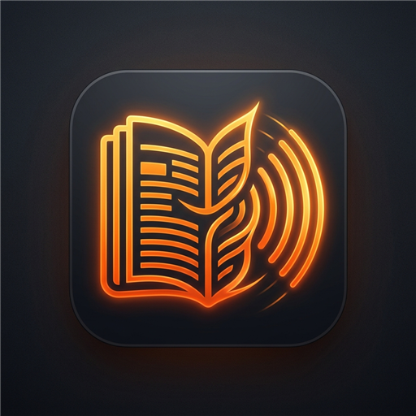

# 🗞️ Chronicle Android — Lector Editorial & Locutor de Noticias con IA On-Device

<div align="center">



**Lector de noticias RSS/Atom con locución periodística sintetizada por Inteligencia Artificial y Text-to-Speech (TTS) 100% local en tu dispositivo.**

[](https://github.com/aralde/last-news-feed-app/actions/workflows/build-apk.yml)
[-3DDC84?logo=android&logoColor=white)](https://android.com)
[-4285F4?logo=google&logoColor=white)](https://huggingface.co/litert-community/gemma-4-E2B-it-litert-lm)
[-FF6F00)](https://github.com/k2-fsa/sherpa-onnx)
[](LICENSE)

</div>

---

## 🌟 Visión del Proyecto

**Chronicle Android** es la adaptación móvil nativa de alta fidelidad inspirada en la aplicación web [last-news-feed](https://github.com/aralde). Combina un diseño editorial elegante y moderno con la potencia de la inteligencia artificial generativa ejecutada **completamente dentro del teléfono**, sin enviar datos a servidores externos ni depender de suscripciones en la nube.

La aplicación permite leer feeds de noticias RSS y Atom, descubrir fuentes automáticamente a partir de páginas web, filtrar por categorías y estados de lectura, y escuchar resúmenes radiofónicos generados por **Google Gemma 4 E2B** y narrados con voces neurales de **Piper TTS** o el sintetizador nativo del sistema.

---

## ✨ Características Principales

### 🧠 1. Inteligencia Artificial 100% On-Device (Google Gemma)
- **Motor Dual de Inferencia Local**:
  - **LiteRT-LM (`.litertlm`)**: Ejecución nativa acelerada por GPU con **OpenCL** en arquitecturas `arm64-v8a` para modelos como `gemma-4-E2B-it-gpu.litertlm` y `gemma-4-E2B-it.litertlm`.
  - **Google MediaPipe Tasks GenAI (`.bin` / `.task`)**: Compatibilidad con modelos cuantizados `int4`/`int8` de Gemma 2 2B.
- **Sin Dependencias de Servidores**: No requiere APIs externas, Ollama ni servidores de fallback. Todo el procesamiento ocurre en la GPU/CPU del smartphone.
- **Resúmenes Periodísticos Claros**: Redacta resúmenes hablados directos (2 a 3 frases) eliminando automáticamente markdown, asteriscos y títulos para una locución oral fluida.
- **Boletín Radiofónico de Hoy (Daily Digest)**: Genera un informativo dinámico matutino que enlaza y sintetiza las noticias más destacadas de todas las fuentes suscritas.

### 🎙️ 2. Síntesis de Voz Neural Offline (Piper TTS & Sistema Android)
- **Motor Piper TTS (Sherpa-ONNX)**:
  - Modelo neural VITS de alta calidad ejecutado con enlace estático en CPU/JNI.
  - **Paquete fonético `espeak-ng-data` empaquetado**: Incluye las tablas de fonetización completas en los assets, extrayéndose de forma transparente para permitir locución sin configuraciones complejas.
- **Descarga de Voces en 1 Toque**: Catálogo integrado con descarga directa de modelos `.onnx` y `tokens.txt`:
  - 🇦🇷 **Español (Argentina)**: `es_AR-daniela-high`
  - 🇪🇸 **Español (España)**: `es_ES-davefx-medium`
  - 🇺🇸 **English (EE. UU.)**: `en_US-amy-medium`
  - 🇬🇧 **English (Reino Unido)**: `en_GB-alan-medium`
- **Importador de Voces Personalizadas**: Selector de documentos nativo para importar cualquier modelo `.onnx` compatible con Piper/Sherpa.
- **Sistema Android Nativo**: Selector instantáneo sin descargas adicionales, compatible con todos los idiomas del sistema.
- **Adaptación Dinámica por Idioma**: Al elegir el idioma de la aplicación (Español / Inglés), las opciones de dialecto regional y el catálogo de voces se adaptan automáticamente.

### ✍️ 3. Prompts del Sistema Completamente Editables
- Los prompts que controlan la redacción de Gemma son personalizables desde la aplicación y se persisten en `DataStore`.
- **Variables dinámicas soportadas**:
  - Resumen individual: `{title}` (Titular) y `{content}` (Cuerpo de la noticia).
  - Boletín diario: `{articles}` (Lista de historias destacadas).
- **Control por Idioma**: Edición independiente para instrucciones en Español e Inglés.
- **Restablecimiento con 1 Toque**: Botón para restaurar los prompts calibrados por defecto en caso de querer revertir cambios.

### 🗂️ 4. Configuración Organizada en Pestañas
La pantalla de Ajustes se organiza en 3 pestañas intuitivas:
1. 🧠 **Modelo & IA**: Estado del motor GPU (LiteRT), selector nativo de archivos de modelo, sliders de temperatura, límite de tokens e idioma base.
2. ✍️ **Prompts**: Editor multilínea con tipografía monoespaciada para Resumen de Noticia y Boletín Diario con panel de variables.
3. 🎙️ **Locución & TTS**: Selección de motor, dialectos regionales adaptativos (AR/ES o US/UK), catálogo de voces descargables, controles de tono/velocidad y botón de prueba de voz.

### 📡 5. Lector RSS/Atom & Paridad con la App Web
- **Autodescubrimiento de Feeds**: Introduce cualquier URL (ej. `https://simonwillison.net` o `https://techcrunch.com`) y Chronicle extraerá automáticamente el endpoint RSS o Atom.
- **Filtros Avanzados (Modal & Chips)**:
  - Filtro por fuentes individuales.
  - Píldoras de estado: **Todas**, **No leídas** y **Favoritas** con contador numérico.
  - Límite de noticias por medio (3, 5, 10, 15).
  - Hashtags y temas bloqueados.
  - Botón de marcado masivo como leído.
- **Reproductor Flotante de Audio**: Barra de reproducción persistente en la parte inferior con visualizador de ondas animadas, control de velocidad (1x, 1.25x, 1.5x, 2x) y servicio en segundo plano (`AudioPlaybackService`) con controles en la barra de notificaciones de Android.

---

## 🏗️ Arquitectura y Tecnologías

```
last-news-feed-app/
├── app/src/main/
│   ├── AndroidManifest.xml              // Declaración de hardware, permisos y bibliotecas OpenCL
│   ├── assets/
│   │   └── espeak-ng-data.zip           // Diccionario fonético completo para síntesis offline
│   ├── libs/
│   │   └── sherpa-onnx-static-link...   // Binario nativo AAR con ONNX Runtime para arm64/armv7/x86_64
│   ├── java/com/chronicle/newsfeed/
│   │   ├── ChronicleApplication.kt      // Inyección de dependencias y orquestación
│   │   ├── MainActivity.kt              // Entrypoint y navegación Compose
│   │   ├── data/
│   │   │   ├── model/Models.kt          // Entidades, Settings y PromptSettings
│   │   │   ├── local/                   // SQLite Room Database & DAOs
│   │   │   └── repository/              // FeedRepository & SettingsRepository (DataStore)
│   │   ├── domain/
│   │   │   ├── feed/                    // Parsers RSS 2.0 / Atom 1.0 y Jsoup Auto-Discovery
│   │   │   ├── llm/
│   │   │   │   ├── LlmManager.kt        // Inferencia híbrida LiteRT-LM GPU / MediaPipe
│   │   │   │   └── NewsPrompts.kt       // Templates y motor de sustitución de variables
│   │   │   └── tts/
│   │   │       ├── TtsManager.kt        // Orquestador de reproducción y audio track
│   │   │       ├── SherpaPiperTtsEngine.kt // Motor nativo Piper VITS
│   │   │       ├── AndroidSystemTtsEngine.kt // Motor del sistema Android
│   │   │       └── PiperDownloader.kt   // Gestor de descargas de voces HuggingFace
│   │   ├── service/
│   │   │   └── AudioPlaybackService.kt  // Foreground Service con notificación multimedia
│   │   └── ui/
│   │       ├── theme/                   // Sistema de diseño editorial Material 3
│   │       ├── components/              // Player flotante, visualizador y tarjetas
│   │       ├── feed/                    // FeedScreen & FeedViewModel
│   │       ├── reader/                  // Pantalla de lectura completa del artículo
│   │       ├── digest/                  // Modal interactivo de Boletín de Noticias
│   │       └── settings/                // Pantalla de ajustes con sistema de pestañas
│   └── res/
│       ├── drawable/app_logo.png        // Isotipo oficial de Chronicle
│       ├── mipmap-*/                    // Iconos adaptativos en todas las densidades
│       └── raw/default_sources.json     // Fuentes preconfiguradas (IA, Tecnología, etc.)
└── .github/workflows/
    └── build-apk.yml                    // Pipeline CI/CD para compilación de APK en GitHub
```

| Capa | Tecnología |
|---|---|
| **UI & Diseño** | Jetpack Compose + Material 3 (Dark & Light editorial theme) |
| **Persistencia** | Room (SQLite) con reactividad mediante Kotlin `Flow` |
| **Preferencias** | Jetpack DataStore Preferences |
| **Red & Parsing** | OkHttp 4 + Jsoup (HTML/RSS/Atom) + Coil (Carga asíncrona de imágenes) |
| **LLM On-Device** | Google LiteRT-LM (OpenCL GPU) + Google MediaPipe Tasks GenAI |
| **TTS Neural** | Piper VITS mediante `sherpa-onnx-static-link-onnxruntime` + Android TTS |
| **Audio Playback** | `AudioTrack` PCM streaming + Android `ForegroundService` |

---

## 📲 Guía Rápida de Configuración

### 1. Modelo Gemma On-Device (.litertlm)
Para habilitar la redacción automática de noticias y el boletín matutino:
1. Descarga el modelo **Gemma 4 E2B IT** en formato `.litertlm` desde Hugging Face:
   - [gemma-4-E2B-it-gpu.litertlm (Recomendado)](https://huggingface.co/litert-community/gemma-4-E2B-it-litert-lm/blob/main/gemma-4-E2B-it-gpu.litertlm) (~2.6 GB)
   - O [gemma-4-E2B-it.litertlm](https://huggingface.co/litert-community/gemma-4-E2B-it-litert-lm/blob/main/gemma-4-E2B-it.litertlm) (~2.0 GB)
2. Guarda el archivo en tu teléfono (por ejemplo, en la carpeta `Descargas`).
3. Abre **Chronicle > Configuración (engranaje) > Modelo & IA**.
4. Pulsa **"Buscar archivo de modelo (.litertlm)"** y selecciona el archivo descargado. La app lo importará de forma segura y el indicador cambiará a `Modelo cargado y listo (GPU LiteRT)`.

### 2. Voces de Piper TTS
1. En **Configuración > Locución & TTS**, selecciona **Piper TTS (Neural)**.
2. Elige tu acento preferido (ej. Argentina `es_AR`, España `es_ES`, EE. UU. `en_US` o Reino Unido `en_GB`).
3. Pulsa el icono de descarga junto a la voz deseada (ej. **Daniela (Argentina)** o **Amy (EE. UU.)**).
4. Pulsa **"Probar Voz"** para escuchar una muestra locutada en tiempo real.

---

## 🛠️ Compilación y Desarrollo

### Requisitos Previos
- **Android Studio Ladybug** (o superior)
- **JDK 17**
- **Android SDK** con API 35 (mínimo soportado: API 26 / Android 8.0)

### Compilación Local
Para compilar la versión Release optimizada desde la terminal:

```bash
# En Windows (PowerShell)
$env:JAVA_HOME="C:\Program Files\Android\Android Studio\jbr"
.\gradlew.bat assembleRelease

# En Linux / macOS
export JAVA_HOME="/ruta/a/tu/jdk-17"
chmod +x gradlew
./gradlew assembleRelease
```

El APK resultante se generará en:
`app/build/outputs/apk/release/app-release.apk`

---

## 🔄 Integración Continua (GitHub Actions)

El repositorio incluye un flujo de trabajo automatizado en [`.github/workflows/build-apk.yml`](.github/workflows/build-apk.yml) que:
1. Se dispara en cada `push` o `pull_request` a las ramas `main`/`master`, o de forma manual vía `workflow_dispatch`.
2. Configura JDK 17 y las dependencias de Gradle en un entorno Ubuntu.
3. Verifica la presencia del runtime nativo Sherpa-ONNX.
4. Compila el APK Release firmado de forma determinista.
5. Sube el instalador empaquetado como artefacto (`Chronicle-NewsFeed-Release-APK`) disponible para descarga directa durante 30 días.
6. Si se publica un tag de versión (ej. `v1.0.0`), crea automáticamente una GitHub Release con el APK adjunto.

---

## 📄 Licencia

Este proyecto se distribuye bajo la licencia **MIT**. Consulta el archivo [LICENSE](LICENSE) para más detalles.
